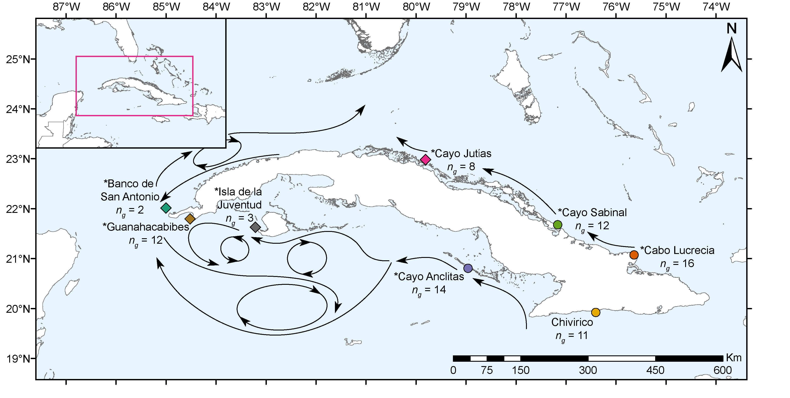

```{r setup, include=FALSE}
knitr::opts_chunk$set(echo = TRUE)
knitr::opts_chunk$set(warning = FALSE, fig.align = 'left')
knitr::opts_knit$set(root.dir = '../data')
options(width = 88)
```
***

# About this document
#### version: `r Sys.Date() %>% format(format="%B %d, %Y")`
***  
All analyses were performed in R version 3.6.2. 
This is the code that accompanies the publication XXX. Here you will find all the code to repeat the statistical analyses performed in R and the figures created for the manuscript. The accompanying library preparation protocol and bioinformatic walkthrough can be found by clicking on the links.

Code to produce these figures was generated with help from [Ryan Eckert](https://ryanjeckert.weebly.com){target="_blank"}, if you think this walkthrough is helpful check out similar ones for Symbiodiniaceae *ITS2* analyses [here](https://RyanEckert.github.io/Belize_Mcav_Symbiodiniaceae_ITS2/stats){target="_blank"}.  

***

# Basic setup of R environment
***

## Loading required packages
Make sure to set the working directory: 
`setwd("~/path/to/directory/with/data")`

```{r, set working directory}
setwd("../data")
```

For the following analyses we will require the use of multiple different R packages, we can use the package *pacman* to quickly load them.
```{r, load packages, include = TRUE, message = FALSE, warning = FALSE, results = 'hide'}
if (!require("pacman")) install.packages("pacman")
pacman::p_load("adegenet", "dendextend", "ggdendro", "hierfstat", "Imap", "patchwork", "poppr", "RColorBrewer", "reshape2", "StAMPP", "tidyverse", "vcfR", "vegan", "paletteer", "WGCNA")
```

# Figures and analyses
***
## Figure 1: Map of sampling sites
This figure was created in ArcMap and Adobe Illustrator



## Figure 2: IBS dendrogram with clones
The following chunk of code uses the IBS matrix generated from ANGSD to produce an Identity-By-State Dendrogram which we can use to ensure that technical replicates are clustering together and to identify natural clones from the SNP dataset.

```{r, SNP IBS Dendrogram With Clones, fig.dim = c(13, 4.75)}
cloneBams = read.table("sample_list")[,1] # list of bam files
cloneMa = as.matrix(read.table("trimmed_mc_w_clones.ibsMat")) # reads in IBS matrix produced by ANGSD
dimnames(cloneMa) = list(cloneBams,cloneBams)
clonesHc = hclust(as.dist(cloneMa),"ave")

cloneMeta = read.table("clonePops.txt", sep="\t") # list of bams files and their populations
clonePops = cloneMeta$V2

cloneDend = cloneMa %>% as.dist() %>% hclust(.,"ave") %>% as.dendrogram()
cloneDData = cloneDend %>% dendro_data()

plotPops = c("Banco de San Antonio", "Cabo Lucrecia", "Cayo Anclitas", "Cayo Jutías",
             "Cayo Sabinal", "Chivirico", "Guanahacabibes", "Isla de la Juventud")

# Making the branches hang shorter so we can easily see clonal groups
cloneDData$segments$yend2 = cloneDData$segments$yend
for(i in 1:nrow(cloneDData$segments)) {
  if (cloneDData$segments$yend2[i] == 0) {
    cloneDData$segments$yend2[i] = (cloneDData$segments$y[i] - 0.03)
  }
}

cloneDendPoints = cloneDData$labels
cloneDendPoints$pop = clonePops[order.dendrogram(cloneDend)]
rownames(cloneDendPoints) = cloneDendPoints$label

# Making points at the leaves to place symbols for populations
point = as.vector(NA)
for(i in 1:nrow(cloneDData$segments)) {
  if (cloneDData$segments$yend[i] == 0) {
    point[i] = cloneDData$segments$y[i] - 0.03
  } else {
    point[i] = NA
  }
}

cloneDendPoints$y = point[!is.na(point)]

head(cloneDendPoints)
techReps = c("44-1", "44-2", "44-3", "61-1", "61-2", "61-3", "18-1", "18-2", "18-3")

cloneDendA = ggplot() +
  geom_segment(data = segment(cloneDData), aes(x = x, y = y, xend = xend, yend = yend2), size = 0.5) +
  geom_point(data = cloneDendPoints, aes(x = x, y = y, fill = pop), size = 4, shape = 21, stroke = 0.25) +
  geom_hline(yintercept = 0.15, color = "red", lty = 5, size = 0.75) + # creating a dashed line to indicate a clonal distance threshold
  geom_text(data = subset(cloneDendPoints, subset = label %in% techReps), aes(x = x, y = (y - .015), label = label), angle = 90) + # spacing technical replicates further from leaf
  geom_text(data = subset(cloneDendPoints, subset = !label %in% techReps), aes(x = x, y = (y - .010), label = label), angle = 90) +
  geom_text(data = subset(cloneDendPoints, subset = label %in% c("03", "04", "41", "43")), aes(x = (x + .5), y = (y - .018), label = "*"), angle = 90, size = 6) + # labeling natural clones with asterisks
  scale_fill_brewer(palette = "Dark2", name = "Population", labels = plotPops) +
  guides(fill = guide_legend(override.aes = list(size = 4), ncol = 2)) +
  coord_cartesian(xlim = c(3, 84)) +
  labs(y = "Genetic distance (1 - IBS)") +
  theme_classic()

cloneDend = cloneDendA + theme(
  axis.title.x = element_blank(),
  axis.text.x = element_blank(),
  axis.line.x = element_blank(),
  axis.ticks.x = element_blank(),
  axis.title.y = element_text(size = 12, color = "black", angle = 90),
  axis.text.y = element_text(size = 10, color = "black"),
  axis.line.y = element_line(),
  axis.ticks.y = element_line(),
  panel.grid = element_blank(),
  panel.border = element_blank(),
  panel.background = element_blank(),
  plot.background = element_blank(),
  legend.key = element_blank(),
  legend.title = element_text(size = 12),
  legend.text = element_text(size = 10),
  legend.position = c(.5, .12)
  )

cloneDend
```

From this dendrogram you can see that there are two pairs of samples (indicated by their asterisks) that exhibit similar distances as the technical replicates. These are natural clones which agree with the clones identified in the microsatellite dataset based on multi-locus genotypes.

Save the dendrogram:

```{r, Dendrogram save}
ggsave("../rMarkdown/Figure2.eps", plot = cloneDend, height = 4.75, width = 13, units = "in", dpi = 300)
ggsave("../rMarkdown/Figure2.tiff", plot = cloneDend, height = 4.75, width = 13, units = "in", dpi = 300)
```

## Figure 3: Heterozygosity plot
Observed and expected heterozygosity values were calculated for microsatellites in [GenAlEx](https://biology-assets.anu.edu.au/GenAlEx/Welcome.html){target="_blank"} and for SNPs using the *populations* function in the popular RADseq analysis program, [*STACKS*](http://catchenlab.life.illinois.edu/stacks/manual/){target="_blank"}. These values and their standard error's are incorporated in the "Heterozygosity_Values.csv" file.

```{r, Heterozygosity plot, fig.dim = c(7, 4)}
cubaHetero = read.csv("Heterozygosity_Values.csv", header = TRUE)

hetPlotA = ggplot(cubaHetero, aes(x = Analysis.Type, y = Heterozygosity, fill = Population, 
                                  alpha = Type)) +
  geom_bar(position = position_dodge(), stat = "identity", color = 'black') +
  scale_y_continuous(expand = c(0, 0)) +
  geom_errorbar(aes(ymin = Heterozygosity-Error, ymax = Heterozygosity+Error), 
                width = 0.6, position = position_dodge(0.9)) +
  scale_fill_brewer(palette = "Dark2", labels = plotPops) +
  scale_alpha_manual(values = c(1, 0.75), name = "Heterozygosity") +
  labs(x ="Analysis Type", y = "Heterozygosity") +
  guides(fill = guide_legend(order = 1)) +
  theme_classic() 

hetPlot = hetPlotA + theme(panel.border = element_blank(), 
                           panel.grid.major = element_blank(), 
                           panel.grid.minor = element_blank(), 
                           axis.line = element_line(color = "black"),
                           axis.text = element_text(size = 14, color = "black"),
                           axis.title.y = element_text(size = 14),
                           legend.title = element_text(size = 14),
                           legend.text = element_text(size = 14),
                           axis.title.x = element_blank())

hetPlot
```
The plot was edited in Illustrator to give the bars crosshatching texture instead of transparency.

```{r, Heterozygosity plot save}
ggsave("../rMarkdown/Figure3.tiff", plot = hetPlot, width = 25, height = 15, units = "cm", dpi = 300)
ggsave("../rMarkdown/Figure3.eps", plot = hetPlot, width = 25, height = 15, units = "cm", dpi = 300)
```

## Figure 4: Cluster dendrogram without clones
### Microsatellites
The program [*poppr*](https://grunwaldlab.github.io/Population_Genetics_in_R/) can read in microsatallite multi-locus genotypes exported from [GenAlEx](https://biology-assets.anu.edu.au/GenAlEx/Welcome.html){target="_blank"} as .csv files and can calculate a variety of distance metrics from this data. For microsatellite data with some missing loci, they recommend using Prevosti's distance.

```{r, Msat cluster dendrogram, fig.dim = c(17.7, 3.15)}
genAlEx = read.genalex("cuba_trimmed_microsats_genalex.csv")
cubaMicrosatDist = prevosti.dist(genAlEx)
msNoClones = read.table("microsat-list")[,1] # list of bam file
msMa = cubaMicrosatDist
msI2P = read.table("samples2pops",sep = "\t") # 2-column tab-delimited table of individual assignments to populations; must be in the same order as samples in the bam list or vcf file.
row.names(msI2P) = msI2P[,1]

msDend = msMa %>% scale %>% dist %>%
  hclust %>% as.dendrogram

msDData = dendro_data(msDend)
msDendPoints = msDData$labels
msDendPoints$site = msI2P[,2][order.dendrogram(msDend)]

msDendA = ggplot() + 
  geom_segment(data = segment(msDData), aes(x = x, y = y, xend = xend, yend = yend)) +
  geom_point(data = msDendPoints, aes(x = x, y = y, fill = site), size = 5, shape = 21) +
  scale_fill_brewer(palette = "Dark2", name = "Population", labels = plotPops) +
  theme_dendro()

msDend = msDendA + theme(
  legend.key = element_blank(),
  legend.title = element_text(size = 14),
  legend.text = element_text(size = 12))

msDend
```

### SNPs
This dendrogram is similar to Figure 1 but the natural clones and technical replicates are removed allowing us to better identify other patterns.

```{r, SNP cluster dendrogram, fig.dim = c(17.7, 3.15)}
bamsNoClones = read.table("bams_noclones")[,1] # list of bam file
snpMa = as.matrix(read.table("trimmed_mc.ibsMat"))
snpI2P = read.table("inds2pops_noclones.txt",sep = "\t") # 2-column tab-delimited table of individual assignments to populations; must be in the same order as samples in the bam list or vcf file.
row.names(snpI2P) = snpI2P[,1]

snpDend = snpMa %>% scale %>% dist %>%
  hclust %>% as.dendrogram

snpDData = dendro_data(snpDend)
snpDendPoints = snpDData$labels
snpDendPoints$site = snpI2P[,2][order.dendrogram(snpDend)]

snpDendA = ggplot() + 
  geom_segment(data = segment(snpDData), aes(x = x, y = y, xend = xend, yend = yend)) +
  geom_point(data = snpDendPoints, aes(x = x, y = y, fill = site), size = 5, shape = 21) +
  scale_fill_brewer(palette = "Dark2", name = "Population", labels = plotPops) +
  theme_dendro()

snpDend = snpDendA + theme(
  legend.key = element_blank(),
  legend.title = element_text(size = 14),
  legend.text = element_text(size = 12))

snpDend
```

### Combine and save the plots
These plots were combined using the program *patchwork*
```{r, combines cluster dendrogram, fig.dim = c(17.7, 6.3)}
combinedDendro = (msDend / snpDend) +
plot_layout(guides = "collect") + # collapses the legends into one
  plot_annotation(tag_level = "a") & # labels the plots a and b
  theme(plot.tag = element_text(size = 18, face = "bold"))

combinedDendro

ggsave("../rMarkdown/Figure4.tiff", plot = combinedDendro, width = 45, height = 16, units = "cm", dpi = 300)
ggsave("../rMarkdown/Figure4.eps", plot = combinedDendro, width = 45, height = 16, units = "cm", dpi = 300)
```

## Figure 5: Ordination plots

### SNPs
```{r, vcf2genlight}
cubaVcf = read.vcfR("trimmed_mc_renamed.vcf.gz") #T his vcf file has all of your SNP genotype likelihoods and is generated by ANGSD
cubaGenlight = vcfR2genlight(cubaVcf, n.cores = 2) # Converts the vcf file into a file format that poppr uses the "genlight" format
locNames(cubaGenlight) = paste(cubaVcf@fix[,1],cubaVcf@fix[,2],sep="_") 
popData = read.table("vcf_popmap") # Reads in population data for each sample
popData$depth = factor("Shallow", levels = c("Shallow", "Mesophotic")) # Stratifies by depth zone
popData$depth[c(1:2)] = "Mesophotic"
levels(popData$depth)

colnames(popData) = c("sample","population", "depth") 

strata(cubaGenlight) = data.frame(popData)
setPop(cubaGenlight) = ~population

head(cubaGenlight)
```

#### SNPs PCA plot
```{r, SNPs PCA plot, fig.dim = c(4, 4)}
snpPca1 = glPca(cubaGenlight, nf = 77, n.cores = 1) 

snpPcaValues = as.data.frame(snpPca1$scores)
snpPca = data.frame(row.names = rownames(snpPcaValues), sample = rownames(snpPcaValues), 
                    site = popData$population, depth = popData$depth, PC1 = snpPcaValues[,1],
                    PC2 = snpPcaValues[,2])
head(snpPca)

# percentage of explained variance by axes
snpPcVar = round(snpPca1$eig/sum(snpPca1$eig)*100, 1)

# merge centroid locations into ggplot dataframe
snpPca = merge(snpPca, aggregate(cbind(mean.x=PC1,mean.y=PC2)~site,snpPca, mean), by="site")

# SNP PCA biplot
cubaSnpPcaPlotA = ggplot(snpPca, aes(x = PC1, y = PC2, color = site, fill = site, shape = depth)) +
  geom_hline(yintercept = 0, color = "gray90", size = 0.5) +
  geom_vline(xintercept = 0, color = "gray90", size = 0.5) + 
  geom_segment(aes(x = mean.x, y = mean.y, xend = PC1, yend = PC2)) + #spider
  geom_point(shape = 19, size = 3) + #individual's points indicated by circles
  geom_point(aes(x = mean.x, y = mean.y, shape = depth), size = 4, color = "black") + #population centroids indicated by triangles
  scale_shape_manual(values = c(24,25), name = "Depth") +
  scale_fill_manual(values = brewer.pal(name = "Dark2", n = 8), name = " Population", labels = plotPops) +
  scale_color_manual(values = brewer.pal(name = "Dark2", n = 8), name = " Population", labels = plotPops, guides(order = 0)) +  
  xlab(paste ("PC 1 (", snpPcVar[1],"%)", sep = "")) + #Prints percent variation explained by first axis
  ylab(paste ("PC 2 (", snpPcVar[2],"%)", sep = "")) + #Prints percent variation explained by second axis
  guides(fill = guide_legend(override.aes = list(shape = 22, size = 4, color = NA), order = 1))+
  theme_bw()

cubaSnpPcaPlot = cubaSnpPcaPlotA + 
  theme(axis.title.x = element_text(color = "black", size = 10),
        axis.text.x = element_blank(),
        axis.ticks.x = element_blank(),
        axis.line.x = element_blank(),
        axis.title.y = element_text(color = "black", size = 10),
        axis.text.y = element_blank(),
        axis.ticks.y = element_blank(),
        axis.line.y = element_blank(),
        legend.position = "none",
        panel.border = element_rect(color = "black", size = 1.2),
        panel.background = element_rect(fill = "white"),
        plot.background = element_rect(fill = "white"),
        panel.grid.major = element_blank(),
        panel.grid.minor = element_blank())

cubaSnpPcaPlot
```

#### SNPs PCoA plot
Principal coordinates analysis (PCoA) based on Nei's genetic distance calculated among the populations.
```{r, SNPs PCoA plot, fig.dim = c(6, 4)}
#First calculate Nei's genetic distance using the program STAMPP
cubaSnpDpop = stamppNeisD(cubaGenlight, pop = TRUE) # Nei's 1972 distance between pops 
#This mimics the by population PCoA of GenAlEx 

# This is the actual PCoA step; you can use any distance matrix here (euclidean = PCA), 
# We are using Nei's genetic distance
cubaMds = cmdscale(cubaSnpDpop, eig = TRUE, x.ret = TRUE)

# Determine percent variation captured on each axis 
# Calculate the eigenvalues so later we can figure out % variation shown on each Principal Coordinate
cubaSnpPcoaVar = round(cubaMds$eig/sum(cubaMds$eig)*100, 1)
cubaSnpPcoaVar

# Format data to plot
cubaSnpPcoaValues = cubaMds$points

cubaSnpPcoaValues =as.data.frame(cubaSnpPcoaValues, sample = rownames(cubaSnpPcoaValues))
cubaSnpPcoa = data.frame(site = rownames(cubaSnpPcoaValues), 
                         depth = factor(c("Mesophotic","Shallow","Shallow","Shallow","Shallow","Shallow","Shallow","Shallow"), 
                                        levels=c("Shallow","Mesophotic")), 
                         PCo1 = cubaSnpPcoaValues[,1], PCo2 = cubaSnpPcoaValues[,2])

# SNP PCoA biplot
cubaSnpPcoaPlotA = ggplot(cubaSnpPcoa, aes(x = PCo1, y = PCo2, fill = site, shape = depth)) +
  geom_hline(yintercept = 0, color = "gray90", size = 0.5) +
  geom_vline(xintercept = 0, color = "gray90", size = 0.5) + 
  geom_point(size = 4) +
  scale_y_reverse() +
  scale_shape_manual(values = c(24,25), name = "Depth") +
  scale_fill_manual(values = brewer.pal(name = "Dark2", n = 8), name = "Population", labels = plotPops) +
  xlab(paste ("PCo 1 (", cubaSnpPcoaVar[1],"%)", sep = "")) +
  ylab(paste ("PCo 2 (", cubaSnpPcoaVar[2],"%)", sep = "")) +
  guides(fill = guide_legend(override.aes = list(shape = 22, size = 4, color = NA), order = 1))+
  theme_bw()

cubaSnpPcoaPlot = cubaSnpPcoaPlotA + 
  theme(axis.title.x = element_text(color = "black", size = 10),
        axis.text.x = element_blank(),
        axis.ticks.x = element_blank(),
        axis.line.x = element_blank(),
        axis.title.y = element_text(color = "black", size = 10),
        axis.text.y = element_blank(),
        axis.ticks.y = element_blank(),
        axis.line.y = element_blank(),
        legend.position = "left",
        legend.title = element_text(color = "black", size = 10),
        legend.text = element_text(color = "black", size = 10),
        legend.key = element_blank(),
        panel.border = element_rect(color = "black", size = 1.2),
        panel.background = element_rect(fill = "white"),
        plot.background = element_rect(fill = "white"),
        panel.grid.major = element_blank(),
        panel.grid.minor = element_blank())

cubaSnpPcoaPlot
```

### Microsatellites
#### Microsatellite PCA
```{r, MSAT PCA plot, fig.dim = c(4, 4)}
cubaMsat = read.genalex("cuba_trimmed_microsats_genalex.csv", genclone = FALSE)
xMsat = tab(cubaMsat, freq = TRUE, NA.method = "mean")
mSatPca1 = dudi.pca(xMsat, center = TRUE, scale = FALSE, scannf = FALSE, nf = 77)

mSatPcaValues = as.data.frame(mSatPca1$li)
mSatPca = data.frame(row.names = rownames(mSatPcaValues), sample = rownames(mSatPcaValues), 
                     site = as.factor(popData$population), depth = popData$depth, 
                     PC1 = mSatPcaValues[,1], PC2 = mSatPcaValues[,2])

# percentage of explained variance by axes
mSatPcVar = round(mSatPca1$eig/sum(mSatPca1$eig)*100, 1)
mSatPcVar

# merge centroid locations into ggplot dataframe
mSatPca = merge(mSatPca, aggregate(cbind(mean.x = PC1, mean.y = PC2) ~ site, mSatPca, mean), by = "site")

# construct PCA biplot
cubaMsatPcaPlotA = ggplot(mSatPca, aes(x, y, color = site, fill = site)) +
  geom_hline(yintercept = 0, color = "gray90", size = 0.5) +
  geom_vline(xintercept = 0, color = "gray90", size = 0.5) + 
  geom_segment(aes(x = mean.x, y = mean.y, xend = PC1, yend = PC2)) + #spider
  geom_point(aes(x = PC1, y = PC2), shape = 19, size = 3) + #individuals
  geom_point(aes(x = mean.x, y = mean.y, shape = depth), size = 4, color = "black") + #centroids
  scale_shape_manual(values = c(24,25), name = "Depth") +
  scale_fill_manual(values = brewer.pal(name = "Dark2", n = 8), name = " Population", labels = plotPops) +
  scale_color_manual(values = brewer.pal(name = "Dark2", n = 8), name = " Population", labels = plotPops, guides(order = 0)) +
  xlab(paste ("PC 1 (", mSatPcVar[1],"%)", sep = "")) +
  ylab(paste ("PC 2 (", mSatPcVar[2],"%)", sep = "")) +
  guides(fill = guide_legend(override.aes = list(size = 4, shape = 22, color = NA), order = 1))+
  theme_bw()

cubaMsatPcaPlot = cubaMsatPcaPlotA + 
  theme(axis.title.x = element_text(color = "black", size = 10),
        axis.text.x = element_blank(),
        axis.ticks.x = element_blank(),
        axis.line.x = element_blank(),
        axis.title.y = element_text(color = "black", size = 10),
        axis.text.y = element_blank(),
        axis.ticks.y = element_blank(),
        axis.line.y = element_blank(),
        legend.position = "none",
        panel.border = element_rect(color = "black", size = 1.2),
        panel.background = element_rect(fill = "white"),
        plot.background = element_rect(fill = "white"),
        panel.grid.major = element_blank(),
        panel.grid.minor = element_blank())


cubaMsatPcaPlot
```

#### Microsatellite PCoA
```{r, MSAT PCoA plot, fig.dim = c(4, 4)}
cubaMsatPcoa = read.csv("cubaMsatPcoa.csv", header = TRUE, check.names = FALSE)

cubaMsatPcoaPlotA = ggplot(cubaMsatPcoa, aes(x = PCo1, y = PCo2, fill = site, shape = depth)) +
  geom_hline(yintercept = 0, color = "gray90", size = 0.5) +
  geom_vline(xintercept = 0, color = "gray90", size = 0.5) + 
  geom_point(size = 4) +
  scale_shape_manual(values = c(25,24), name = "Depth") +
  scale_fill_manual(values = brewer.pal(name = "Dark2", n = 8), name = "Population", labels = plotPops) +
  xlab("PCo 1 (58.0%)") +
  ylab("PCo 2 (14.1%)") +
  guides(fill = guide_legend(override.aes = list(shape = 22, size = 4, color = NA)))+
  theme_bw()

cubaMsatPcoaPlot = cubaMsatPcoaPlotA + 
  theme(axis.title.x = element_text(color = "black", size = 10),
        axis.text.x = element_blank(),
        axis.ticks.x = element_blank(),
        axis.line.x = element_blank(),
        axis.title.y = element_text(color = "black", size = 10),
        axis.text.y = element_blank(),
        axis.ticks.y = element_blank(),
        axis.line.y = element_blank(),
        legend.position = "none",
        panel.border = element_rect(color = "black", size = 1.2),
        panel.background = element_rect(fill = "white"),
        plot.background = element_rect(fill = "white"),
        panel.grid.major = element_blank(),
        panel.grid.minor = element_blank())

cubaMsatPcoaPlot
```

### Combine all the plots together with *patchwork*
```{r, combine ord plots, fig.dim = c(9.84, 7.87)}
cubaOrdPlots = (cubaMsatPcoaPlot|cubaMsatPcaPlot)/(cubaSnpPcoaPlot|cubaSnpPcaPlot) +
  plot_layout(guides = 'collect') + 
  plot_annotation(tag_level = "a") &
  theme(plot.tag = element_text(size = 14, face = "bold"))

cubaOrdPlots

ggsave("../rMarkdown/Figure5.eps", plot = cubaOrdPlots, height = 20, width = 25, unit = "cm", dpi = 300)
ggsave("../rMarkdown/Figure5.tiff", plot = cubaOrdPlots, height = 20, width = 25, unit = "cm", dpi = 300)
```

## Calculating AMOVA from SNP data
Taking a break from making figures, here is how AMOVA and significance was calculated from the SNP dataset using *[*poppr*](https://grunwaldlab.github.io/Population_Genetics_in_R/)*.The AMOVA for microsatellites was run in [GenAlEx](https://biology-assets.anu.edu.au/GenAlEx/Welcome.html){target="_blank"}.
```{r, AMOVA vcf, results='hide'}
cubaVcf = read.vcfR("trimmed_mc_renamed.vcf.gz") #Read in vcf
cubaGenlight = vcfR2genlight(cubaVcf, n.cores = 2) #Convert to genlight
locNames(cubaGenlight) = paste(cubaVcf@fix[,1],cubaVcf@fix[,2],sep="_") 
popData = read.table("vcf_popmap") #Strata by population and depth zone
popData$depth = factor("Shallow", levels = c("Shallow", "Mesophotic"))
popData$depth[c(1:2)] = "Mesophotic"
levels(popData$depth)

colnames(popData) = c("sample","population", "depth") 
levels(popData$population) = plotPops 
strata(cubaGenlight) = data.frame(popData)
setPop(cubaGenlight) = ~population

cubaGenlight
```

```{r, AMOVA}
amova <- poppr.amova(cubaGenlight, ~population) #Runs AMOVA
amova
```
Partitions amount of variance at each level: Among populations, among individuals within a population, and within an individual.

```{r, AMOVA significance}
set.seed(1999)
amovasignif   <- randtest(amova, nrepet = 999) #Calculates significance levels of the AMOVA with 999 permutations
amovasignif
```

## Figure 6: Pairwise Fst Heat Maps
### Microsatellites
Pairwise Fst values and associated p-values were calculated in [GenAlEx](https://biology-assets.anu.edu.au/GenAlEx/Welcome.html){target="_blank"} and read in as matrices in csv files.
```{r, Fstmicrosat, fig.dim = c(13.4, 4.9)}
# reads in fst matrix
msFstMa = read.csv("fst-values.csv", head = TRUE)
msFstMa
pops = plotPops[c(1, 7, 8, 3, 6, 2, 5, 4)]

# renames row headers
names(msFstMa) = c("Pop", pops)

# maintains column order as given
msFstMa$Pop = factor(msFstMa$Pop, levels = unique(msFstMa$Pop))
levels(msFstMa$Pop) = pops

# reads in q value matrix
msQMa = read.csv("fst-q-values.csv") #q-values are FDR-corrected p-values
names(msQMa) = c("Pop", pops)
msQMa$Pop = factor(msQMa$Pop, levels=unique(msQMa$Pop))
levels(msQMa$Pop) = pops

# melts fst and q value matrices into table used by ggplot2
# missing values (NA) not used
msFst= melt(msFstMa, id.vars = "Pop", value.name = "Fst", variable.name = "Pop2", na.rm = TRUE)
msFst = msFst[msFst$Pop != msFst$Pop2,]
head(msFst)

msQ = melt(msQMa, id.vars = "Pop", value.name = "Fst", variable.name = "Pop2", na.rm = TRUE)
msQ = msQ[msQ$Pop != msQ$Pop2,]
head(msQ)

# ggplot2 heatmap using geom_tile
# uses gradient of red color to denote increasing pop differentiation through Fst
# geom_text puts the Fst value in each grid
heatmap=ggplot(data = msFst, aes(Pop, Pop2, fill = Fst))+ 
  geom_tile(color = "white")+ 
  scale_fill_gradient2(low = "white", high ="red", midpoint=0, limit = c(0,0.22), # change the upper threshold based on your highest Fst
                       space = "Lab", name = expression(paste(italic("F")[ST])))+ 
  geom_text(data = subset(msFst, Fst = 0), aes(Pop, Pop2, label = Fst), 
            color = ifelse(msQ$Fst <= 0.05, "black", ifelse(msQ$Fst >= 1,"white","darkgrey")), 
            size = ifelse(msQ$Fst < 0.05, 6, 5)) +
  guides(fill = guide_colorbar(barwidth = 1, barheight = 12, title.position = "top", title.hjust = 0.5)) + 					
  scale_y_discrete(position = "right") +
  scale_x_discrete(labels = str_wrap(msFst$Pop, width = 6)) +
  theme_minimal()

msHeatmap=heatmap+theme(
  axis.text.x = element_text(vjust = 1, size = 16, hjust = 0.5,color="black"), 
  axis.text.y = element_text(size=16,color="black"),
  axis.title.x = element_blank(),
  axis.title.y = element_blank(),
  panel.grid.major = element_blank(),
  panel.border = element_blank(),
  panel.background = element_blank(),
  axis.ticks = element_blank(),
  legend.justification = c(1, 0),
  legend.position = "right",
  legend.direction = "vertical",
  legend.title = element_text(size = 18), 
  legend.text = element_text(size = 14)) 
  
msHeatmap
```

### SNPs
Calculate pairwise Fst among populations
```{r, pairwiseFstSNP}
cuba.fst<-stamppFst(cubaGenlight, nboots = 99, percent =95, nclusters=1) #99 permutations

cuba.fst$Fsts
cuba.fst$Pvalues

write.csv(cuba.fst$Fsts, "../rMarkdown/cubaFST.csv")
write.csv(cuba.fst$Pvalues, "../rMarkdown/cubap-values.csv")

```
FDR correct the p-values to q-values and round the Fst values to 3  digits.

```{r, FstSNP, fig.dim = c(13.4, 4.9)}
# reads in fst matrix
snpFstMa = read.csv("cubaFST.csv", head = TRUE)

names(snpFstMa) = c("Pop", pops)

snpFstMa$Pop = factor(snpFstMa$Pop, levels = unique(snpFstMa$Pop))
levels(snpFstMa$Pop) = pops

snpQMa = read.csv("cubaq-values.csv")
names(snpQMa)=c("Pop", pops)
snpQMa$Pop = factor(snpQMa$Pop, levels=unique(snpQMa$Pop))
levels(snpQMa$Pop) = pops

snpFst = melt(snpFstMa, id.vars = "Pop", value.name = "Fst", variable.name = "Pop2", na.rm = TRUE)
snpFst = snpFst[snpFst$Pop != snpFst$Pop2,]
head(snpFst)

snpQ = melt(snpQMa, id.vars = "Pop", value.name = "Fst", variable.name = "Pop2", na.rm = TRUE)
snpQ = snpQ[snpQ$Pop != snpQ$Pop2,]
head(snpQ)

snpHeatmapA = ggplot(data = snpFst, aes(Pop, Pop2, fill = Fst))+ 
  geom_tile(color = "white")+ 
  scale_fill_gradient2(low = "white", high = "red", midpoint = 0, limit = c(0, 0.22), 
                       space = "Lab", name = expression(paste(italic("F")[ST])))+ 
  theme_minimal()+ 
  geom_text(data = subset(snpFst, Fst = 0), 
            aes(Pop, Pop2, label = Fst),
            color = ifelse(snpQ$Fst <= 0.05,"black",ifelse(snpQ$Fst >= 1,"white","darkgrey")),
            size = ifelse(snpQ$Fst < 0.05, 6, 5)) +
  guides(fill=guide_colorbar(barwidth = 1, barheight = 12, title.position = "top", title.hjust = 0.5))+ 					
  scale_y_discrete(position="right")+
  scale_x_discrete(labels=str_wrap(snpFst$Pop, width=6))

snpHeatmap = snpHeatmapA + theme(
  axis.text.x = element_text(vjust = 1, size = 16, hjust = 0.5, color = "black"), 
  axis.text.y = element_text(size = 16, color = "black"),
  axis.title.x = element_blank(),
  axis.title.y = element_blank(),
  panel.grid.major = element_blank(),
  panel.border = element_blank(),
  panel.background = element_blank(),
  axis.ticks = element_blank(),
  legend.justification = c(1, 0),
  legend.position = "right",
  legend.direction = "vertical",
  legend.title = element_text(size = 18),
  legend.text = element_text(size = 14))

snpHeatmap
```

###Combine all the plots together with *patchwork*
```{r, fstHeatMapCombined, fig.dim = c(13.4, 9.8)}
combinedHeatmap = (msHeatmap / snpHeatmap) +
 plot_layout(guides = 'collect') +
 plot_annotation(tag_level = "a") &
 theme(plot.tag = element_text(size = 20, face = "bold"))

combinedHeatmap

ggsave("../rMarkdown/Figure6.tiff", plot = combinedHeatmap, width = 34, height = 25, units = "cm", dpi = 300)
ggsave("../rMarkdown/Figure6.eps", plot = combinedHeatmap, width = 34, height = 25, units = "cm", dpi = 300)
```

## Figure 7: STRUCTURE/ADMIXTURE plots
### Microsatellite STRUCTURE plot
```{r, msatStructure, fig.dim = c(11.8, 3)}
msStr = read.csv("sortedK2-microsat-structure.csv")
msStr$Sample = factor(msStr$Sample, 
                             levels = msStr$Sample[order(msStr$Cluster2)])
msStr$Order = c(1:nrow(msStr))
msStrDat = melt(msStr, id.vars = c("Sample", "Population", "Order"), 
                variable.name = "Ancestry", value.name = "Fraction")

colPalStr = c("blue", "turquoise")

names(colPalStr) = levels(msStrDat$Ancestry)


msStructureA = ggplot(msStrDat, aes(x = Order, y = Fraction, fill = Ancestry)) +
  geom_bar(stat = "identity", position = "fill", width = 1, colour = "grey25") +
  facet_grid(~fct_inorder(Population), scales = "free", switch = "x", space = "free") +
  xlab("Population") +
  scale_x_discrete(expand = c(0, 0)) +
  scale_y_continuous(expand = c(0, 0)) +
  scale_fill_manual(values = colPalStr) +
  labs(y = "Ancestry") +
  coord_cartesian(ylim = c(-.01,1.01), clip = "off") +
  theme_bw()

msStructure = msStructureA + theme(
  plot.title = element_text(hjust = 0.5),
  panel.grid = element_blank(),
  panel.background = element_rect(fill=NA, colour="black"),
  panel.spacing.x = grid:::unit(0, "lines"),
  panel.border = element_rect(fill = NA, color = "black", size = 2, linetype = "solid"),
  axis.text.x = element_blank(),
  axis.text.y = element_text(size = 12, color = "black"),
  axis.title.x = element_blank(),
  axis.title.y = element_text(size = 16, color = "black"),
  axis.ticks.x = element_blank(),
  axis.ticks.y = element_line(color = "black"),
  strip.background = element_blank(),
  strip.text = element_blank(),
  legend.key = element_blank(),
  legend.title = element_blank(),
  legend.position = "none"
)

msStructure
```

### SNP ADMIXTURE plot
```{r, snpAdmixture, fig.dim = c(11.8, 4.9)}
snpStr = read.csv("sorted_K2_admixture.csv")
snpStr$Sample = factor(snpStr$Sample, 
                             levels = snpStr$Sample[order(snpStr$Cluster2)])
strPops = c("Banco de \nSan Antonio", "Cabo Lucrecia", "Cayo Anclitas", "Cayo Jutías",
            "Cayo Sabinal", "Chivirico", "Guanahacabibes", "Isla de la \nJuventud")

levels(snpStr$Population) = strPops
snpStr$Order = c(1:nrow(snpStr))

snpStrDat = melt(snpStr, id.vars=c("Sample", "Population", "Order"), 
            variable.name="Ancestry", value.name="Fraction")

popAnnoStr = data.frame(x1 = c(0.55, 62.55, 25.55, 17.55, 39.55, 51.55, 2.55, 14.55),
                        x2 = c(2.45, 78.45, 39.45, 25.45, 51.45, 62.45, 14.45, 17.45),
                        y1 = -0.045, y2 = -0.045, Sample = NA, Ancestry = NA, 
                        Population = strPops)

snpAdmixA = ggplot(snpStrDat, aes(x = Order, y = Fraction, fill = Ancestry)) +
  geom_bar(stat = "identity", position = "fill", width = 1, colour = "grey25") +
  geom_segment(data = popAnnoStr, aes(x = x1, xend = x2, y = y1, yend = y2, color = Population), size = 3) +
  geom_text(data = popAnnoStr, aes(x = (x2-.05), y = (y1-.05), label = Population), angle = 75, hjust = 1, vjust = 0, size = 5, lineheight = 0.65) +
  facet_grid(~fct_inorder(Population), scales = "free", switch = "x", space = "free") +
  labs(x = "Population", y = "Ancestry") +
  scale_x_discrete(expand = c(0, 0)) +
  scale_y_continuous(expand = c(0, 0)) +
  scale_fill_manual(values = colPalStr) +
  scale_color_brewer(palette = "Dark2") +
  coord_cartesian(ylim = c(-.01,1.01), clip = "off") +
  theme_bw()

snpAdmix = snpAdmixA + theme(
  plot.title = element_text(hjust = 0.5),
  plot.background = element_rect(fill = NA, color = NA),
  panel.grid = element_blank(),
  panel.background = element_rect(fill = NA, color = "black"),
  panel.spacing.x = grid:::unit(0, "lines"),
  panel.border = element_rect(fill = NA, color = "black", size = 2, linetype = "solid"),
  axis.text.x = element_blank(),
  axis.text.y = element_text(size = 12, color = "black"),
  axis.title.x = element_text(size = 16),
  axis.title.y = element_text(size = 16, color = "black"),
  axis.ticks.x = element_blank(),
  axis.ticks.y = element_line(color = "black"),
  strip.background = element_rect(color = NA, fill = NA),
  strip.text = element_text(size = 16, angle = 90, hjust = 1, vjust = 0.1, color = NA),
  legend.key = element_blank(),
  legend.title = element_blank(),
  legend.position = "none"
)

snpAdmix
```

### Combine all the plots together with *patchwork*
```{r, structureAdmixtureCombined, fig.dim = c(11.8, 7.9)}
combinedAdmix = (msStructure / snpAdmix) +
  plot_annotation(tag_level = "a") &
  theme(plot.tag = element_text(size = 18, face = "bold"))

combinedAdmix

ggsave("../rMarkdown/Figure7.tiff", plot = combinedAdmix, width = 30, height = 20, units = "cm", dpi = 300)
ggsave("../rMarkdown/Figure7.eps", plot = combinedAdmix, width = 30, height = 20, units = "cm", dpi = 300)
```

## Figure 8: Algal Symbiont Proxy Assemblages
```{r, zooxPlot, fig.dim = c(13.5, 4.9)}
dfZoox = read.csv("zoox-proportions.csv")
dfZoox$Order = c(1:nrow(dfZoox))

strPops = c("Banco de \nSan Antonio", "Cabo Lucrecia", "Cayo Anclitas", "Cayo Jutías",
            "Cayo Sabinal", "Chivirico", "Guanahacabibes", "Isla de la \nJuventud")

levels(dfZoox$Population) = strPops

zDat = melt(dfZoox, id.vars = c("Sample", "Population", "Order"), variable.name = "Symbiont", value.name = "Fraction")

colPalZoox = brewer.pal(4, "BrBG")
names(colPalZoox) = levels(zDat$Symbiont)

popAnnoZoox = data.frame(x1 = c(0.55, 62.55, 25.55, 17.55, 39.55, 51.55, 2.55, 14.55),
                         x2 = c(2.45, 78.45, 39.45, 25.45, 51.45, 62.45, 14.45, 17.45), 
                         y1 = -0.045, y2 = -0.045, Sample = NA, Symbiont = NA, Order = NA,
                           Population = strPops)

zooxPlotA = ggplot(data = zDat, aes(x = Order, y = Fraction, fill = Symbiont, order = Order)) +
  geom_bar(stat = "identity", position = "fill", width = 1, colour = "grey25") +
  xlab("Population") +
  scale_x_discrete(expand = c(0, 0)) +
  scale_y_continuous(expand = c(0, 0), labels = function(x) paste0(x*100, "%")) +
  scale_fill_manual(values = colPalZoox, name = "Symbiodiniaceae genus") +
  geom_segment(data = popAnnoZoox, aes(x = x1, xend = x2, y = y1, yend = y2, color = strPops), size = 3) +
  scale_color_brewer(palette = "Dark2") +
  geom_text(data = popAnnoZoox, aes(x = (x2-.05), y = (y1-.05), label = Population), angle = 75, hjust = 1, vjust = 0, size = 5, lineheight = 0.65) +
  facet_grid(.~fct_inorder(Population), scales = "free", switch = "x", space = "free") +
  coord_cartesian(ylim = c(-.01,1.01), clip = "off") +
  guides(color = FALSE) +
  theme_bw()
  
zooxPlot = zooxPlotA + theme(
  plot.title = element_blank(),
  panel.background = element_blank(),
  panel.spacing.x = grid:::unit(0, "lines"),
  panel.border = element_rect(color = "black", size = 2, linetype = "solid"),
  axis.text.x=element_blank(),
  axis.text.y=element_text(size = 12, color = "black"),
  axis.title.x=element_text(size = 16),
  axis.title.y = element_blank(),
  axis.ticks.x=element_blank(),
  axis.ticks.y = element_line(color = "black"),
  strip.text=element_text(size = 16, angle = 90, hjust = 1, vjust = 0, color = NA),
  strip.background = element_blank(),
  legend.text = element_text(face = "italic")
)

zooxPlot

ggsave("../rMarkdown/Figure8.tiff", plot = zooxPlot, width = 34.35, height = 12.5, units = "cm", dpi = 300)
ggsave("../rMarkdown/Figure8.eps", plot = zooxPlot, width = 34.35, height = 12.5, units = "cm", dpi = 300)
```

# Supplementary Figures

## Supplementary Figure S1: Mantel Isolation by Distance
First we can calculate the geographic distances:
```{r, geographic distances}

ReplaceLowerOrUpperTriangle = function(m, triangle.to.replace) {
  if (nrow(m) != ncol(m))
    stop("Supplied matrix must be square.")
  if (tolower(triangle.to.replace) == "lower")
    tri = lower.tri(m)
  else if (tolower(triangle.to.replace) == "upper")
    tri = upper.tri(m)
  else
    stop("triangle.to.replace must be set to 'lower' or 'upper'.")
  m[tri] = t(m)[tri]
  return(m)
}
  # If triangle.to.replace="lower", replaces the lower triangle of a square matrix with its upper triangle.
  # If triangle.to.replace="upper", replaces the upper triangle of a square matrix with its lower triangle.

GeoDistanceInMetresMatrix = function(df.geopoints) {
  # Returns a matrix (M) of distances between geographic points. M[i,j] = M[j,i] = Distance between (df.geopoints$lat[i], df.geopoints$lon[i]) and (df.geopoints$lat[j], df.geopoints$lon[j]). The row and column names are given by df.geopoints$name.
  
  GeoDistanceInMetres = function(g1, g2) {
    # Returns a vector of distances. (But if g1$index > g2$index, returns zero.) The 1st value in the returned vector is the distance between g1[[1]] and g2[[1]]. The 2nd value in the returned vector is the distance between g1[[2]] and g2[[2]]. Etc. Each g1[[x]] or g2[[x]] must be a list with named elements "index", "lat" and "lon". E.g. g1 = list(list("index"=1, "lat"=12.1, "lon"=10.1), list("index"=3, "lat"=12.1, "lon"=13.2))
    
    DistM = function(g1, g2) {
      require("Imap")
      return(ifelse(
        g1$index > g2$index,
        0,
        gdist(lat.1 = g1$lat, lon.1 = g1$lon, lat.2 = g2$lat, lon.2 = g2$lon, units = "m")))
    }
    return(mapply(DistM, g1, g2))
  }
  
  n.geopoints = nrow(df.geopoints)
  
  # The index column is used to ensure we only do calculations for the upper triangle of points
  df.geopoints$index = 1:n.geopoints
  
  # Create a list of lists
  list.geopoints = by(df.geopoints[, c("index", "lat", "lon")], 1:n.geopoints, function(x) {
    return(list(x))
  })
  
  # Get a matrix of distances (in metres)
  mat.distances = ReplaceLowerOrUpperTriangle(outer(list.geopoints, list.geopoints, GeoDistanceInMetres), "lower")
  
  # Set the row and column names
  rownames(mat.distances) = df.geopoints$name
  colnames(mat.distances) = df.geopoints$name
  return(mat.distances)
}
```

### Microsats
Mantel's test
```{r, ms mantel}
coords = read.csv ("xycoords.csv", header=TRUE) # tab-separated file for all pops

dGeo = as.dist(GeoDistanceInMetresMatrix(coords)/1000, diag = T)

msNeiDist = read.csv("neis-distance.csv", header=TRUE)
msNeiMa = as.matrix(msNeiDist)
msNeiDistMa = dist(msNeiMa, diag = FALSE)

# Test IBD
set.seed(694)
msIBD = mantel.randtest(dGeo, msNeiDistMa)
msIBD
```

Microsat Mantel plot
```{r, ms mantel plot, fig.dim = c(4.9, 4.9)}
msNei =  melt(as.matrix(msNeiDistMa), varnames = c("row", "col"), value.name = "nei")
msNei = msNei[msNei$row > msNei$col,]

geo = melt(as.matrix(dGeo), varnames = c("row", "col"), value.name = "geo")
geo = geo[geo$row != geo$col,]

msMantelDF = data.frame(cbind(msNei$nei, geo$geo))
colnames(msMantelDF) = c("nei", "geo")

# Plot IBD
msMantelA = ggplot(data = msMantelDF, aes(x = geo, y = nei)) +
  scale_fill_gradientn(colors = paletteer_d("wesanderson::Zissou1")) +
  stat_density_2d(aes(fill = stat(density)), n = 300, contour = FALSE, geom = "raster") +
  geom_smooth(method = lm, col = "black", fill = "gray40", fullrange = TRUE) +
  geom_point(shape = 21, fill = "gray40") +
  scale_x_continuous(limits = c(0,1000), expand = c(0,0)) +
  scale_y_continuous(limits = c(0,2), expand = c(0,0)) +
  annotate("label", x = 775, y = 1.91, 
           label = paste("r = ", round(msIBD$obs, 3), "; p = ", msIBD$pvalue), 
           size = 4, alpha = 0.6) +
  labs(x = "Geographic distance (km)", y = expression(paste("Nei's genetic distance (",italic("D"),")"))) +
  theme_bw()

msMantel = msMantelA + theme(
  axis.title.x = element_blank(),
  axis.text.x = element_text(size = 12, color = "black"),
  axis.ticks.x = element_line(color = "black"),
  axis.line.x = element_blank(),
  axis.title.y = element_text(color = "black", size = 14),
  axis.text.y = element_text(size = 12, color = "black"),
  axis.ticks.y = element_line(color = "black"),
  axis.line.y = element_blank(),
  panel.border = element_rect(size = 1.2, color = "black"),
  plot.margin = margin(0.2,0.5,0.1,0.1, unit = "cm"),
  legend.position = "none"
  )

msMantel

### SNPs ------------
```

### SNPs
Mantel's test
```{r, SNP mantel}
# Isolation by distance
popdata<-read.table("vcf_popmap")
colnames(popdata)<-c("sample","population") 
strata(cubaGenlight) = data.frame(popdata) #cubaGenlight was generated in Odination Analyses above
setPop(cubaGenlight)= ~population
snpNeiDist = as.dist(stamppNeisD(cubaGenlight, pop = TRUE), diag = F)

# Test IBD
set.seed(694)
snpIBD = mantel.randtest(dGeo,snpNeiDist)
snpIBD
```

SNP Mantel plot
```{r, SNP mantel plot, fig.dim = c(4.9, 4.9)}
snpNei =  melt(as.matrix(snpNeiDist), varnames = c("row", "col"), value.name = "nei")
snpNei = snpNei[snpNei$row != snpNei$col,]

snpMantelDF = data.frame(cbind(snpNei$nei, geo$geo))
colnames(snpMantelDF) = c("nei", "geo")

snpMantelA = ggplot(data = snpMantelDF, aes(x = geo, y = nei)) +
  scale_fill_gradientn(colors = paletteer_d("wesanderson::Zissou1")) +
  stat_density_2d(aes(fill = stat(density)), n = 300, contour = FALSE, geom = "raster") +
  geom_smooth(method = lm, col = "black", fill = "gray40", fullrange = TRUE) +
  geom_point(shape = 21, fill = "gray40") +
  scale_x_continuous(limits = c(0,1000), expand = c(0,0)) +
  scale_y_continuous(limits = c(0,0.15), breaks = seq(0,0.15, by = 0.05), expand = c(0,0)) +
  annotate("label", x = 775, y = 0.14325, 
           label = paste("r = ", round(snpIBD$obs, 3), "; p = ", snpIBD$pvalue), 
           size = 4, alpha = 0.6) +             
  labs(x = "Geographic distance (km)", y = expression(paste("Nei's genetic distance (",italic("D"),")"))) +
  theme_bw()

snpMantel = snpMantelA + theme(
  axis.title.x = element_blank(),
  axis.text.x = element_text(size = 12, color = "black"),
  axis.ticks.x = element_line(color = "black"),
  axis.line.x = element_blank(),
  axis.title.y = element_text(color = "white"),
  axis.text.y = element_text(size = 12, color = "black"),
  axis.ticks.y = element_line(color = "black"),
  axis.line.y = element_blank(),
  panel.border = element_rect(size = 1.2, color = "black"),
  plot.margin = margin(0.2,0.5,0.1,0.1, unit = "cm"),
  legend.position = "none"
)

snpMantel
```

```{r, combine mantel plots, fig.dim = c(9.8, 4.9)}
mantelPlots = (msMantel | snpMantel) +
  plot_annotation(tag_level = "a") +
  plot_annotation(caption = "Geographic distance (km)", 
                  theme = theme(plot.caption = element_text(size = 14, hjust = 0.5))) &
  theme(plot.tag = element_text(size = 16, face = "bold"))

mantelPlots

ggsave("../figures/FigureS1.tiff", height = 12.5, width = 25, units = "cm", dpi = 300)
```

## Supplementary Figure S2: Model Probability Plots

### Log Probability of $K$ Plot
```{r, log K plot, fig.dim = c(4, 4)}
strctrHrvstr = read.csv("structureHarvesterOut.csv", header = TRUE)
head(strctrHrvstr)
bestStr = strctrHrvstr[1,]

logKPlotA = ggplot(strctrHrvstr, aes(x = K, y = Mean.LnP.K.)) +
  geom_point(color = "black", size = 3) +
  geom_point(data = bestStr, aes(x = K, y = Mean.LnP.K.), fill = "red", size = 3,  shape = 21) +
  geom_errorbar(aes(ymin = Mean.LnP.K. - Stdev.LnP.K., 
                    ymax = Mean.LnP.K. + Stdev.LnP.K.), width = 0.65) +
  scale_x_continuous(breaks = seq(0,12, by = 2)) +
  labs(y = "Mean Ln(probability)") +
  theme_bw()

logKPlot = logKPlotA + theme(
  axis.title.x = element_blank(),
  axis.title.y = element_text(size = 14, color = "black"),
  axis.text= element_text(size = 12, color = "black"),
  axis.line = element_blank(),
  panel.border = element_rect(size = 1)
)

logKPlot
```

### $\Delta K$ Plot
```{r, deltaK plot, fig.dim = c(4, 4)}
bestDK = strctrHrvstr[2,]

deltaKPlotA = ggplot(strctrHrvstr, aes(x = K, y = Delta.K), color = "black") +
  geom_path(size = 1, aes(x = K)) +
  geom_point(size = 3) +
  geom_point(data = bestDK, aes(x = K, y = Delta.K), fill = "red", size = 3,  shape = 21) +
  scale_x_continuous(breaks = seq(0,12, by = 2)) +
  labs(y = expression(paste(Delta, italic("K")))) +
  theme_bw()

deltaKPlot = deltaKPlotA + theme(
  axis.title.x = element_blank(),
  axis.title.y = element_text(size = 14, color = "black"),
  axis.text= element_text(size = 12, color = "black"),
  axis.line = element_blank(),
  panel.border = element_rect(size = 1)
)

deltaKPlot
```

### Bayesian Information Criterion plot
```{r, BIC plot, fig.dim = c(4, 4)}
snpBIC = read.csv("BIC_Values.csv", header = TRUE)
head(snpBIC)

bestBIC = snpBIC[2,]

bicPlotA = ggplot(snpBIC, aes(x = Number.of.Clusters..K., y = BIC), color = "black") +
  geom_point(size = 3) +
  geom_path(size = 1) +
  geom_point(data = bestBIC, aes(x = Number.of.Clusters..K., y = BIC), fill = "red", size = 3,  shape = 21) +
  scale_x_continuous(breaks = seq(0,12, by = 2)) +
  labs(y = "BIC") +
  theme_bw()

bicPlot = bicPlotA + theme(
  axis.title.x = element_blank(),
  axis.title.y = element_text(size = 14, color = "black"),
  axis.text= element_text(size = 12, color = "black"),
  axis.line = element_blank(),
  panel.border = element_rect(size = 1)
)

bicPlot
```

### Admiture Cross Validation Plot
```{r, model cross validation plot, fig.dim = c(4, 4)}
cvAdmix = read.csv("CV_Values_ADMIXTURE.csv", header =TRUE)
bestCV = cvAdmix[1,]

cvPlotA = ggplot(cvAdmix, aes(x = Number.of.clusters, y = Model.Cross.Validation.Values), color = "black") +
  geom_point(size = 3) +
  geom_path(size = 1) +
  geom_point(data = bestCV, aes(x = Number.of.clusters, y = Model.Cross.Validation.Values), fill = "red", size = 3,  shape = 21) +
  scale_x_continuous(breaks = seq(0,12, by = 2)) +
  labs(y = "Model cross validation") +
  theme_bw()

cvPlot = cvPlotA + theme(
  axis.title.x = element_blank(),
  axis.title.y = element_text(size = 14, color = "black"),
  axis.text= element_text(size = 12, color = "black"),
  axis.line = element_blank(),
  panel.border = element_rect(size = 1)
)

cvPlot
```

### Combine all plots
```{r, grop model plots, fig.dim = c(6.7, 6.3)}
modelKPlots = (logKPlot | deltaKPlot)/(bicPlot|cvPlot) +
  plot_layout(widths = c(20,1,20)) +
  plot_annotation(caption = expression(paste("Genetic clusters (",italic(K),")")),
                  theme = theme(plot.caption = element_text(size = 14, hjust = 0.5))) +
  plot_annotation(tag_level = "a") &
  theme(plot.tag = element_text(size = 16, face = "bold"))

modelKPlots

ggsave("../figures/FigureS2.tiff", width = 17, height = 16, units = "cm", dpi = 300)
ggsave("../figures/FigureS2.eps", width = 17, height = 16, units = "cm", dpi = 300)
```